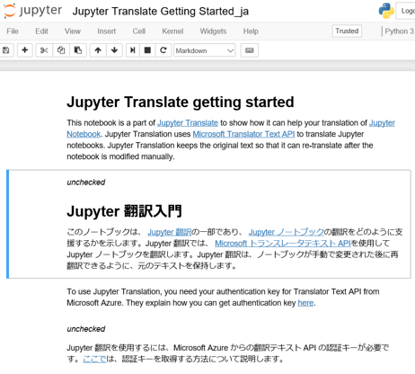
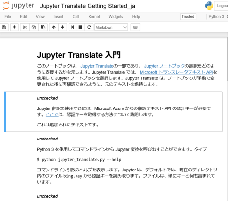

# Jupyter Translate getting started

This notebook is a part of [Jupyter Translate](https://github.com/kiidax/jupyter-translate)
to show how it can help your translation of [Jupyter Notebook](https://jupyter.org/). Jupyter Translation uses
[Microsoft Translator Text API](https://www.microsoft.com/en-us/translator/translatorapi.aspx)
to translate Jupyter notebooks. Jupyter Translation keeps the original text so that it can re-translate after the notebook
is modified manually.

To use Jupyter Translation, you need your authentication key for Translator Text API from Microsoft Azure. They explain how you can get authentication key [here](https://www.microsoft.com/en-us/translator/getstarted.aspx). 

You can invoke Jupyter Translate from the command line using Python 3. Type

```
$ python jupyter_translate.py --help
```

to show the help of command line arguments. Jupyter Translate reads authentication key from file `bing.key`
in the current directory by default. The file just contains key and nothing else.

## Making parallel documents

If you want to modify the machine translated text, it is often easier to keep the original texts near the translated ones.
`--preserve` option keep the original text and add machine translated text after that. Type

```
$ mkdir 
$ python jupyter_translate.py --to-lang ja --preserve examples
```

This translates all Jupyter notebooks in `examples` directory and creates new files with `_ja` appended to the file names.
The created files can be opened with Jupyter Notebook like the original ones.



Often you modify both the original notebook and the translated notebook and need to merge them together.
Here's how you can do that.

## Modifing the translated notebook

Every translated text has _unchecked_ at the beginning of the text. This tells the tool that the text hasn't been
manually modified by humans and it can be replaced with the translated text when the tool is run again.

Let's remove _unchecked_ from the second cell in the translated notebook,
the one translated from the first cell, then modify the translated text
a bit. Here, "Jupyter 翻訳" should not be transtated as it is the name of the tool itself.

You can remove the first cell if you want. The translated cells remember the original texts in the metadata so that
the tool can use them when the tool is run again.

## Modifying the original notebook

You can also modify the original notebook. Let's add something like, "This is an added text." at the end of the second
cell in the original notebook, which it starts with "To use Jupyter...".

## Update the translated notebook

Type

```
$ python jupyter_translate.py --update --to-lang ja examples
```

This update the translated notebook with the original notebook.


